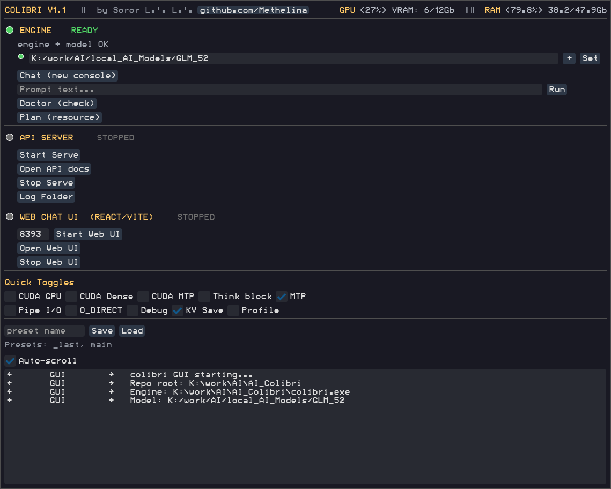
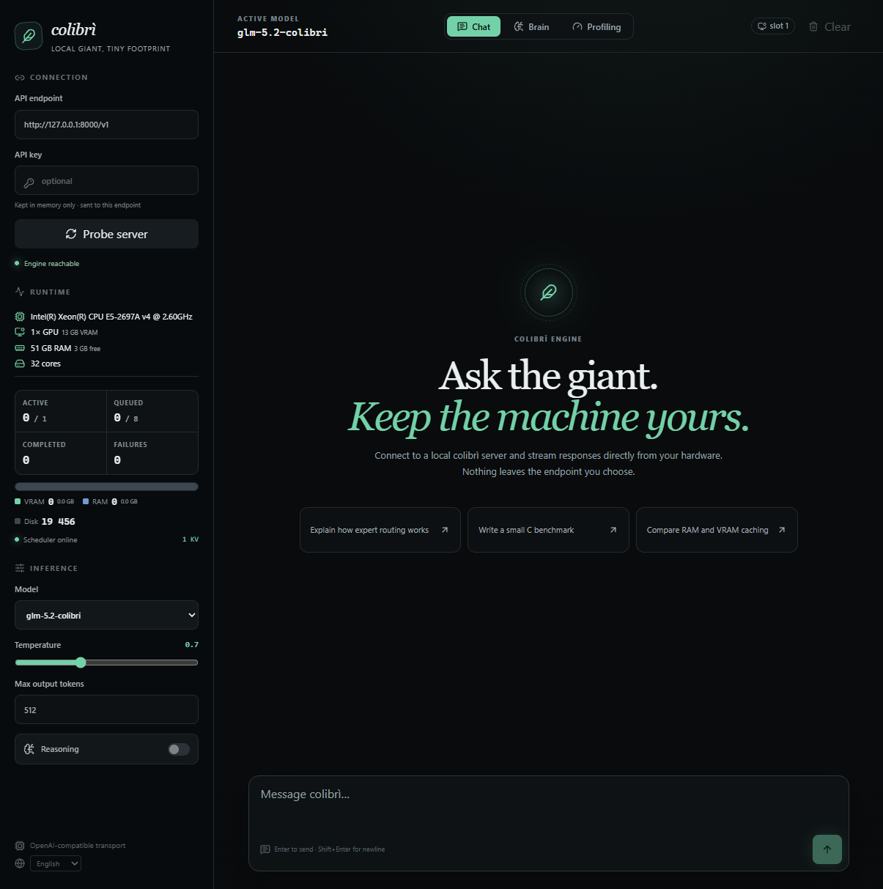

# colibri Portable — Windows GUI Edition (Русский)

> **Маленький движок, огромная модель.** Запуск GLM-5.2 (744 млрд параметров MoE) на домашнем компьютере — на чистом C, с потоковой загрузкой экспертов с диска.

Это портативная GUI-сборка оригинального проекта [colibri](https://github.com/JustVugg/colibri) от [JustVugg](https://github.com/JustVugg). Автор GUI-обвязки: **Soror L.'. L.'.** · [GitHub проекта](https://github.com/Methelina/AI_Colibri_GUI_Portable)

---



---

## Что мы добавили

| Возможность | Описание |
|-------------|----------|
| **Панель управления** | DearPyGui GUI: запуск/остановка сервера, чат, one-shot генерация, мониторинг GPU/RAM |
| **One-click установщик** | `Install_Colibri-UV.ps1` — скачивает всё: движок, Python 3.12, зависимости |
| **CUDA-сборка** | `build_cuda.ps1` — пересобирает движок с поддержкой NVIDIA GPU |
| **Загрузчик моделей** | Встроенный pycurl-загрузчик с докачкой (~370 GB) |
| **Веб-интерфейс** | React/Vite дашборд, подключается к локальному API |
| **Пресеты конфигураций** | Сохранение/загрузка всех настроек в один клик |
| **Шрифты ModeSeven** | Терминальная эстетика с кириллицей |

---

## Порядок действий (пошагово)

### Шаг 1. Установка

Открой PowerShell в папке проекта и выполни **одну** команду:

```powershell
.\Install_Colibri-UV.ps1
```

Инсталлятор сам скачает:
- Утилиту `uv` (менеджер Python-окружений)
- Готовый `colibri.exe` с GitHub Releases
- Python 3.12 в изолированную папку `colibri_env`
- DearPyGui, psutil, pycurl

### Сборка с поддержкой NVIDIA GPU (опционально)

Если есть видеокарта NVIDIA — собери CUDA-версию движка:

```powershell
.\build_cuda.ps1
```

**Что делает скрипт:**
1. Ищет **CUDA Toolkit** (nvcc) — в `PATH`, в `CUDA_PATH`, в `Program Files\NVIDIA`
2. Ищет **MinGW gcc** — в `PATH`, в `C:\msys64\`, `C:\mingw64\`
3. Ищет **MSVC Build Tools** (vcvars64.bat) — VS2022 Community/Pro/BuildTools
4. Определяет архитектуру GPU через `nvidia-smi` (RTX 3060 → sm_86, RTX 4090 → sm_89 и т.д.)
5. Собирает `coli_cuda.dll` (nvcc + cl.exe) и `colibri.exe` (gcc + CUDA-загрузчик)

**Если инструмент не найден** — скрипт предложит ввести путь вручную с подсказкой где скачать.

**Если найдено несколько версий** (например CUDA 12.6 и 12.8) — скрипт попросит выбрать цифрой `[0] [1]`.

**Требования для сборки:**
- **CUDA Toolkit** (≥12.0): [developer.nvidia.com/cuda-downloads](https://developer.nvidia.com/cuda-downloads)
- **MinGW gcc**: `scoop install mingw-winlibs` или MSYS2 → `pacman -S mingw-w64-ucrt-x86_64-gcc`
- **MSVC Build Tools**: `winget install Microsoft.VisualStudio.2022.BuildTools` — выбрать workload «Desktop development with C++»

После успешной сборки в GUI включи тоглы **CUDA GPU** и **CUDA Dense**.

### Шаг 2. Запуск GUI

```powershell
.\Run_Colibri.ps1
```

Откроется окно панели управления.

### Шаг 3. Модель

1. В строке ввода укажи путь к папке с моделью (или нажми **+** чтобы выбрать через проводник)
2. Нажми **Set**
3. Если папка пуста — появится кнопка **Download Model (~370 GB)**. Загрузка возобновляемая, можно прерывать и продолжать.
4. Зелёный кружок слева от поля = модель найдена

### Шаг 4. Запуск

Порядок для обычного использования:

1. **Включи нужные тоглы** (см. таблицу ниже)
2. Нажми **Start Serve** — запустится OpenAI-совместимый API на порту 8000
3. Нажми **Start Web UI** — запустится веб-интерфейс на порту 5173:



4. В веб-интерфейсе нажми **Probe server** для подключения к API
5. Начинай чат!

Альтернативно: кнопка **Chat (new console)** запустит интерактивный чат в отдельном окне.

---

## Тоглы — что и когда включать

| Тогл | Рекомендация | Что делает |
|------|-------------|------------|
| **CUDA GPU** | ☑ ON если есть NVIDIA | Включает GPU-бэкенд. Требует `coli_cuda.dll` (ставится через `build_cuda.ps1`) |
| **CUDA Dense** | ☑ ON вместе с CUDA GPU | Выносит dense-матрицы (~10 GB) на видеокарту. Требует 12+ GB VRAM |
| **CUDA MTP** | ☐ OFF всегда | MTP-спекуляция под CUDA: расхождение точности int4/fp даёт 0% acceptance |
| **Think block** | ☐ OFF (☑ ON для режима размышлений) | Включает `<think>` блок GLM-5.2 в ответах |
| **MTP** | ☑ ON всегда | Multi-Token Prediction — ускорение в 2-3 раза на CPU |
| **Pipe I/O** | ☑ ON всегда | Асинхронная загрузка экспертов: диск работает параллельно с вычислениями |
| **O_DIRECT** | ☑ ON на NVMe, ☐ OFF на SATA/HDD | Прямой доступ к диску в обход кэша ОС (+34–65% скорости) |
| **Debug** | ☐ OFF всегда | Сырой вывод движка в stderr — только для отладки |
| **KV Save** | ☑ ON всегда | Сохраняет контекст чата на диск, сессии переживают перезапуск |
| **Profile** | ☑ ON для тестов, ☐ OFF обычно | Профилировщик: перцентили задержек и verdict bottleneck |

### Три типовых конфигурации

**CPU-only** (любой компьютер):
```
MTP ☑  Pipe I/O ☑  O_DIRECT ☑  KV Save ☑
Остальные ☐ OFF
```

**NVIDIA GPU (RTX 3060/4060/4070, 12 GB VRAM)**:
```
CUDA GPU ☑  CUDA Dense ☑  MTP ☑  Pipe I/O ☑  O_DIRECT ☑  KV Save ☑
CUDA MTP ☐ OFF
```

**NVIDIA GPU (24+ GB VRAM)**:
```
CUDA GPU ☑  CUDA Dense ☑  MTP ☑  Pipe I/O ☑  O_DIRECT ☑  KV Save ☑
Дополнительно: задай CUDA_EXPERT_GB=8 через env, включи COLI_CUDA_TC_W4A16=1
```

---

## Структура окна GUI

### Верхняя панель
- `colibri v1.1 | by Soror L.'. L.' | GitHub` — версия, автор, ссылка
- `GPU <0%> VRAM: 0/0Gb` — мониторинг видеопамяти (если есть nvidia-smi)
- `RAM <0%> 0/0Gb` — мониторинг оперативной памяти

### Engine
- Кружок статуса + путь к `colibri.exe`
- **Строка папки модели**: индикатор (зелёный = есть модель), поле ввода, кнопка **+** (выбор папки), кнопка **Set** (сохранить путь)
- **Download Model** — появляется только если папка указана, но модели нет
- **Chat** — чат в новом окне консоли
- **Run** — одиночная генерация по тексту в поле
- **Doctor** — проверка движка и модели
- **Plan** — план размещения модели в RAM/VRAM/диск

### API Server
- Кружок статуса + порт
- **Start Serve** / **Stop Serve** — запуск/остановка OpenAI API (:8000)
- **Open API docs** — документация API в браузере
- **Log Folder** — открыть папку с логами

### Web Chat UI
- Кружок статуса + порт (127.0.0.1:5173)
- **Start Web UI** — запуск веб-интерфейса
- **Open Web UI** — открыть в браузере (требует запущенный API Server)
- **Stop Web UI** — остановить

### Quick Toggles
Чекбоксы для быстрого включения/выключения переменных окружения. Подробное описание — выше в таблице.

### Presets
- Поле имени + **Save** / **Load** — сохранить/загрузить все настройки одним именем
- Хранятся в `colibri_presets.json`

### Log
Область лога с автоскроллом — весь вывод движка и сервера в реальном времени.

---

## Требования

| Компонент | Минимум | Рекомендация |
|-----------|---------|--------------|
| ОС | Windows 10/11 | Windows 11 24H2 |
| RAM | 16 GB | 48 GB+ |
| Диск | ~400 GB свободно | NVMe SSD |
| Видеокарта | Не требуется | RTX 3060+ 12 GB VRAM |
| Python | 3.12 (ставится авто) | — |
| Node.js | Для Web UI | 18+ |

## Модель

Рекомендованная модель: [GLM-5.2 int4 + int8 MTP](https://huggingface.co/mateogrgic/GLM-5.2-colibri-int4-with-int8-mtp) (~370 GB). В GUI встроен загрузчик с докачкой через pycurl.

---

## Структура проекта

```
colibri.exe                # C-движок (ставится инсталлятором или собирается build_cuda.ps1)
coli                       # Python-лаунчер
colibri_env/               # Изолированное Python-окружение (авто)
scripts/
├── colibri_gui.py         # DearPyGui панель управления
├── colibri_ctl.py         # Управление процессами serve/chat/run
└── _hf_pycurl_download.py # Загрузчик моделей HuggingFace
bin/res/                   # Шрифты, скриншоты
src/colibri/               # Оригинальные исходники (reference)
```

## Ссылки

- **Оригинальный проект**: [github.com/JustVugg/colibri](https://github.com/JustVugg/colibri)
- **Наш портативный GUI**: [github.com/Methelina/AI_Colibri_GUI_Portable](https://github.com/Methelina/AI_Colibri_GUI_Portable)
- **Модель**: [huggingface.co/mateogrgic/GLM-5.2-colibri-int4-with-int8-mtp](https://huggingface.co/mateogrgic/GLM-5.2-colibri-int4-with-int8-mtp)
- **Сайт colibri**: [justvugg.github.io/colibri](https://justvugg.github.io/colibri)

## Лицензия

Оригинальный движок colibri — MIT, см. [LICENSE](LICENSE). GUI-обвязка и инсталлятор — та же лицензия.
